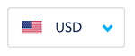

# Currency Select Angular Component

[](https://travis-ci.org/transferwise/tw-currency-select)

> Currency select drop-down with flags

This plugin allows you to create a currency select dropdown on your page just by providing it with a list of currencies



Check a live example <a href="https://rawgit.com/transferwise/tw-currency-select/master/example/index.html" target="_blank">here</a>

The code of the example can be found [here](./example/index.html)

## Getting the plugin

The easiest way is to use bower

    bower install --save https://github.com/transferwise/tw-currency-select.git

## How to use

### Dependencies

1. `angular`
2. `jquery`
3. `bootstrap`
4. `bootstrap-select`

### Simple case

Add the script dependency
```html
<script src="path-to/tw-currency-select.js"></script>
```

Inject the directive into the required module
```js
angular.module('myApp',['tw-currency-select']);
```

Use the html directive
```html
<currency-select
    ng-model="selectedCurrency"
    currencies="currencies"
    ng-change="changedHandler()">
</currency-select>
```

### Mapper & Extractor

Allows providing a `mapper` and an `extractor` to allow any object type in the currency list

Normally the currency-select component expects the currencies to have the following format

```js
[{code: 'EUR'}, {code: 'GBP'}]
```

However by providing a mapper and an extractor as follows you can have a list of whatever type

```html
<currency-select
    ng-model="selectedCurrencyCode"
    currencies="currencyCodes"
    mapper="codeMapper"
    extractor="codeExtractor"
    ng-change="changedCodeHandler()">
</currency-select>
```

```js
$scope.currencyCodes = ['EUR', 'GBP'];

$scope.codeMapper = function(code) {
    return {code: code};
};

$scope.codeExtractor = function(currency) {
    return currency.code;
};
```

### ng-change

You can listen to change events and fire your own function using the `ng-change` attribute

### Hiding search

To hide search you can add the attribute `no-search="true"` to the directive element.

```html
<currency-select
    ng-model="selectedCurrency"
    no-search="true"
    ng-change="changedHandler()">
</currency-select>
```

### Customizing search-placeholder, no-results-text and none-selected-text

You can customize the search-placeholder and no-results text by passing the attributes to the directive element.

```html
<currency-select
    ng-model="selectedCurrency"
    search-placeholder="Search currency..."
    no-results-text="Ups! Nothing found for {0}"
    none-selected-text="Nothing here yet!"
    ng-change="changedHandler()">
</currency-select>
```

### Displaying currency names

To display currency names you just need to decorate your currencies with a name option.

If your currency doesn't have a name it will just be ignored

```js
[{code: 'EUR', name: 'Euro'}, {code: 'GBP', name: 'British Pound'}]
```

### Hiding currency names in the selected value or the options

You can hide the currency names in the selected value or in the options using the properties `hide-name-options` and `hide-name-selected`

```html
<currency-select
    ng-model="selectedCurrency"
    hide-name-options="true"
    hide-name-selected="true">
</currency-select>
```

### Adding custom option at the end of the dropdown menu

You can add (only) one custom `<li>` element at the end of the dropdown-menu by inserting it inside the currency element 

```html
<currency-select
    ng-model="selectedCurrency"
    currencies="currencyList">
    <li><a ng-click="doWhatever()">Other</a></li>
</currency-select>
```
